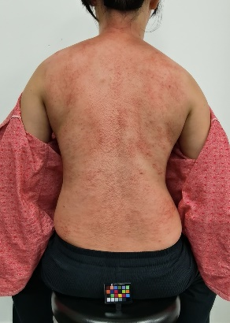
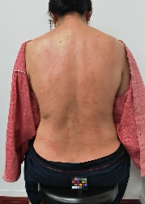

# 中医痧象图像处理

## Traditional Chinese Medicine(TCM) Sha image process

本项目基于计算机视觉相关技术，围绕刮痧后痧象图像进行分析。主要工作为：

- 基于U-Net网络对原始痧象图像完成背部区域分割
- 对痧象图像提取颜色特征与纹理特征，并构建SVM模型对特质进行分类
- 尝试不同编码器与解码器的组合，基于体质分类的多任务多标签学习策略，完成痧象图像描述生成算法

## 更新日志

[2023/5/24] 创建Repo，更新README

## 数据集

数据集为自采数据，暂不公开。数据集中包含痧象图像、患者体质分数、人工描述文本，共503例。

| 痧象图像              |                                                                体质分数                                                                | 文本描述                                                                                                                               |
|:------------------|:----------------------------------------------------------------------------------------------------------------------------------:|:-----------------------------------------------------------------------------------------------------------------------------------|
|| 平和质：53.1   气虚质：46.9   阳虚质：32.1  阴虚质：71.9   痰湿质：78.1   湿热质：62.5   血瘀质：42.9   气郁质：50.0  特禀质：21.4 | 背形：嫩，偏瘦，长。  脊柱：小富贵包，高低肩（左高右低），颈椎3-7节右侧错位，骨盆左高右低，右侧骨盆轻度前旋。  痧象：痧色红，痧多，夹瘀。颈部肌肉隆起，痧多。痧集中于中上焦（颈肩部、乳腺区、心肺区、脾区、肝区），肾区稍红，有少量横络。 

## 模型结果
（1） 背部区域分割

| 原始图像                | 分割图像                |
|:--------------------|:--------------------|
|  |  |

（2）特征提取与体质分类
|核函数	|参数	|accuracy	|precision	|recall	|F1|
|:---:|:---:|:---:|:---:|:---:|:---:|
|linear	|—	|0.5000	|0.5822	|0.5000	|0.5174|
|poly	|degree=2	|0.4000	|0.7039	|0.4000	|0.4708|
|rbf	|gamma='auto'	|0.4200	|0.6826	|0.4200	|0.4840|
|sigmoid	|gamma='auto'	|0.2200	|0.2762	|0.2200	|0.2360|

(3) 痧象图像描述生成

| 原始图像            | 分割图像            | 人工文本                                                     | 输出文本                                                     | 证候标签    | 证候辨识     |
| ------------------- | ------------------- | ------------------------------------------------------------ | ------------------------------------------------------------ | ----------- | ------------ |
|  |  | 痧象 痧色偏红夹瘀 肩部肌肉隆起 痧集中于中上焦 心肺区 脾区 肝区 夹脊处 肾区中间低 两侧高 两侧痧多于中间 有横络 | 痧 象 痧 色 红 偏暗 夹 瘀 痧 集中 于 中上 上焦 颈 肩部 乳腺 区 心肺 区 肝 脾 区 下焦 中间 低 两侧 高 | 痰湿质 59.4    气虚质 56.3  血瘀质 32.1  湿热质 25  阳虚质 21.4  气郁质 17.9  阴虚质 9.4  特禀质 0  | 痰湿质 0.424  气虚质 0.142 湿热质 0.127 阴虚质 0.105 阳虚质 0.095 气郁质 0.054 血瘀质 0.036 特禀质 0.014 |

